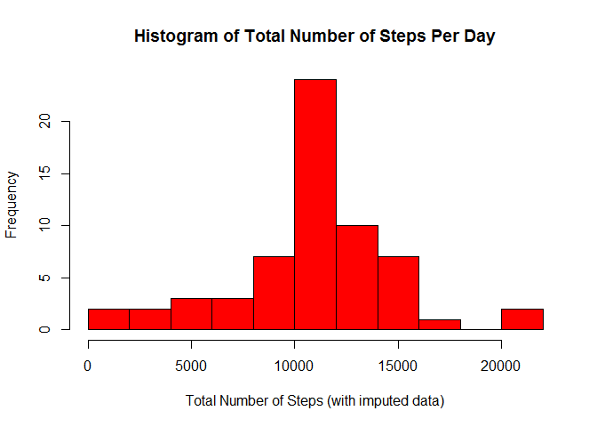

# Reproducible Research: Peer Assessment 1
  
    
## Introduction
The current analysis explores data from a personal activity monitoring
device.  The device collected data about the number of steps taken by an anonymous individual during 5 minute intervals throughout the day 
during the months of October and November 2012.
  
  
## Loading and preprocessing the data  
Activity data were provided by R. Peng in comma-delimited format through the Reproducible Research course on Coursera.  Data were analyzed in RStudio and the R packages "plyr" and "ggplot2" were used in addition to the standard R package.
  
    
  

```r
# Setting up the R workspace -- R code assumes data set activity.csv is
# stored in a directory called activity in the current working directory.
# Load the plyr and ggplot packages for later use.

library(plyr)
library(ggplot2)

# Reading the data file provided in comma-delimited format.
activity <- read.csv("activity/activity.csv")  
totobs <- prettyNum(nrow(activity),big.mark=",",scientific=F)
```

  
    
The activity data set included 17,568 measurements over the two month data collection period and three variables:  

- **steps:** Number of steps
- **date:** Date
- **interval:** An identifier for the 5 minute time interval in which the measurement was taken   

  

```r
str(activity)
```

```
## 'data.frame':	17568 obs. of  3 variables:
##  $ steps   : int  NA NA NA NA NA NA NA NA NA NA ...
##  $ date    : Factor w/ 61 levels "2012-10-01","2012-10-02",..: 1 1 1 1 1 1 1 1 1 1 ...
##  $ interval: int  0 5 10 15 20 25 30 35 40 45 ...
```
  
The date variable was initially read in by R as a factor variable and was converted to a date variable format to facilitate the analysis.
  


```r
# R reads the date variable as a factor variable.  Convert to a date variable.
activity$date <- as.Date(activity$date, format="%Y-%m-%d")

str(activity)
```

```
## 'data.frame':	17568 obs. of  3 variables:
##  $ steps   : int  NA NA NA NA NA NA NA NA NA NA ...
##  $ date    : Date, format: "2012-10-01" "2012-10-01" ...
##  $ interval: int  0 5 10 15 20 25 30 35 40 45 ...
```

Data were collected from October 1 through November 30, 2012 and step counts were missing for some of the time intervals.
  

```r
# Initial summary of the data set
summary(activity)
```

```
##      steps            date               interval   
##  Min.   :  0.0   Min.   :2012-10-01   Min.   :   0  
##  1st Qu.:  0.0   1st Qu.:2012-10-16   1st Qu.: 589  
##  Median :  0.0   Median :2012-10-31   Median :1178  
##  Mean   : 37.4   Mean   :2012-10-31   Mean   :1178  
##  3rd Qu.: 12.0   3rd Qu.:2012-11-15   3rd Qu.:1766  
##  Max.   :806.0   Max.   :2012-11-30   Max.   :2355  
##  NA's   :2304
```


## What is the mean total number of steps taken per day?

Total steps per day varied across the two month period. 
  
  

```r
# Find total steps per day by summing up steps across all time intervals for each day.
stepsum <- ddply(activity,.(date),summarize,daysteps=sum(steps))

# Histogram of steps per day.
hist(stepsum$daysteps,breaks=15,col="red",
     main="Histogram of Total Number of Steps Per Day",
     xlab="Total Number of Steps")
```

 

```r
# Minimum number of steps per day
minstep <- min(stepsum$daysteps,na.rm=TRUE)

# Maximum number of steps per day
maxstep <- prettyNum(max(stepsum$daysteps,na.rm=TRUE),big.mark=",",scientific=F)

# Mean number of steps per day
meanstep <- prettyNum(mean(stepsum$daysteps,na.rm=TRUE),big.mark=",",scientific=F)

# Median number of steps per day
medstep <- prettyNum(median(stepsum$daysteps,na.rm=TRUE),big.mark=",",scientific=F)

# Number of days tracked
numdays <- nrow(stepsum)
```

Total steps per day ranged from 41 to 21,194.  The mean steps per day was 10,766 and the median number of steps per day was 10,765.  The average steps and median number steps are as expected given the goal of 10,000 steps per day set by many users of activity tracking devices.  These data summaries ignore the missing data in the data set.


## What is the average daily activity pattern?

Average number of steps also varied across time interval within days.


```r
# Summarize activity patterns in each interval across all days
interval_sum <- ddply(activity,.(interval),summarize,avgsteps=mean(steps,na.rm=TRUE))

# Time series plot of average steps in time intervals
plot(interval_sum$interval,interval_sum$avgsteps, type="l", col="blue",
     main="Average Daily Activity Patterns",
     xlab="Time Interval", ylab="Average Number of Steps")
```

 

```r
# Find the interval with maximum number of steps on average across all days
maxint <- interval_sum$interval[which.max(interval_sum[,2])]

# Number of intervals summarized
numint <- nrow(interval_sum)
```

The five minute time interval with the most steps on average across the 288 intervals recorded daily was the interval numbered 835.  On average, there was more activity early to mid-day.


## Imputing missing values

The number of steps was missing for some of the time intervals.


```r
# Number of rows in the activity data set
nactivity <- prettyNum(nrow(activity),bigmark=",",scientific=F)

# Number of rows with missing data
nummiss <- sum(!complete.cases(activity))

# Percent of time intervals with missing data
missper <- round((nummiss/nrow(activity))*100)
```

There were 17568 time intervals across the 61 days tracked.  The step count was missing for 2304 of these 17568 intervals.

Missing data were filled in by replacing missing step counts with the average number of steps for that time interval across all 61 days tracked. 


```r
# Add average steps for interval over all days to activity data set
activity_imp <- merge(activity,interval_sum,by="interval")

# Set missing data to average steps across all days for that time interval
activity_imp$csteps <- 
        with(activity_imp, ifelse(is.na(activity_imp$steps),
                                  activity_imp$avgsteps,
                                  activity_imp$steps))
```

Not surprisingly, the distribution of total steps across all days looks similar to the original because the amount of missing data was relatively small (13%) and missing data were filled in with averages.


```r
#sum steps per day
stepsumi <- ddply(activity_imp,.(date),summarize,daystepsi=sum(csteps))

#histogram steps per day
hist(stepsumi$daystepsi,breaks=15,col="red",
     main="Histogram of Total Number of Steps Per Day",
     xlab="Total Number of Steps (with imputed data)")
```

 

```r
#mean number of steps per day
impmean <- prettyNum(mean(stepsumi$daystepsi,na.rm=TRUE),big.mark=",",scientific=F)

#median number of steps per day
impmed <- prettyNum(median(stepsumi$daystepsi,na.rm=TRUE),big.mark=",",scientific=F)
```

The mean number of steps per day with data imputed is 10,766 and the median is 10,766.  The mean and median are basically the same whether or not data are imputed.  After imputation there are more days calculated with around 10,000 steps.    
  

## Are there differences in activity patterns between weekdays and weekends?

It is interesting to consider whether activity patterns were different on weekends than on weekdays.


```r
# Add weekday/weekend factor to imputed data set
activity_imp$daytype <- 
        with(activity_imp, ifelse(
                weekdays(activity_imp$date) %in% c('Saturday','Sunday'),
                                  2,
                                  1))
activity_imp$daytype=factor(activity_imp$daytype,
                               labels=c("Weekdays","Weekends"))


# Summarize intervals across weekday and weekend groups
interval_sum_bytype <- ddply(activity_imp,
                       .(daytype,interval),
                       summarize,avgsteps=mean(csteps))

# Make panel plot with time series plots for weekday and weekend averages
# for each time interval
g <- ggplot(interval_sum_bytype, aes(interval, avgsteps))
g +  facet_grid(daytype ~ .) + 
        geom_line(colour="#990000") +
        labs(title='Average Daily Activity Patterns on Weekdays and Weekends') +
        ylab('Average Number of Steps') +
        xlab('Interval') +
        theme(axis.text.x=element_text(face="bold", vjust=0.5, size=10))
```

 

On average step patterns were quite similar across weekday and weekend days but with higher step counts spread out over more time intervals on the weekends.   

## Summary

Data collected by personal activity monitoring devices contain a lot of rich detail about activity patterns within days and over time and are potentially very useful for individuals interested in increasing daily activity to improve health.
