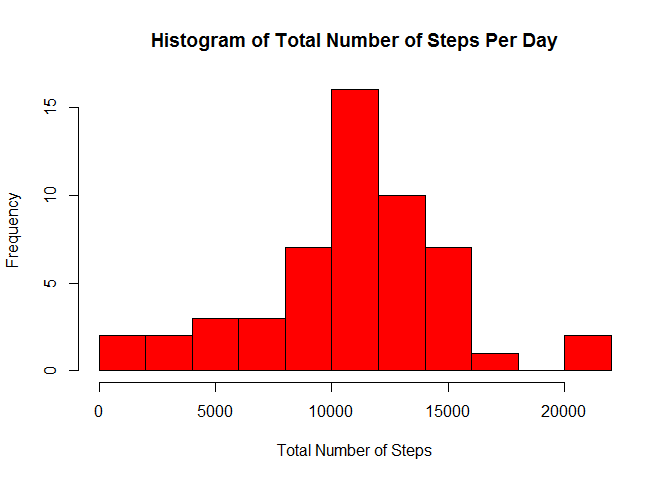
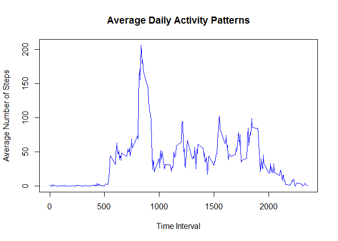
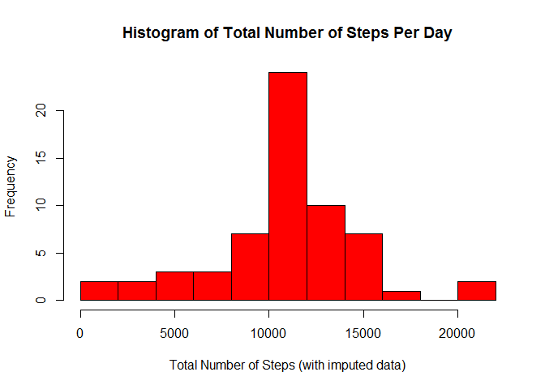
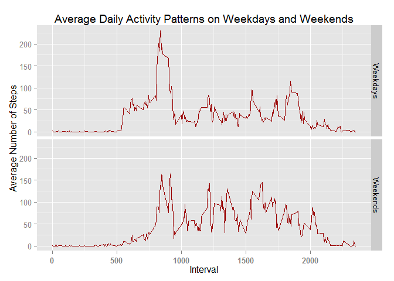

# Reproducible Research: Peer Assessment 1

## Setting up the R workspace

```r
library(plyr)
library(ggplot2)
```

## Loading and preprocessing the data

```r
activity <- read.csv("activity/activity.csv")  

#convert date to date value
activity$date <- as.Date(activity$date, format="%Y-%m-%d")


#need to find total steps per day
stepsum <- ddply(activity,.(date),summarize,daysteps=sum(steps))
```


## What is mean total number of steps taken per day?


```r
#histogram steps per day
hist(stepsum$daysteps,breaks=15,col="red",
     main="Histogram of Total Number of Steps Per Day",
     xlab="Total Number of Steps")
```

 

```r
#mean number of steps per day
mean(stepsum$daysteps,na.rm=TRUE)
```

```
## [1] 10766
```

```r
#median number of steps per day
median(stepsum$daysteps,na.rm=TRUE)
```

```
## [1] 10765
```

## What is the average daily activity pattern?


```r
#activity patterns
interval_sum <- ddply(activity,.(interval),summarize,avgsteps=mean(steps,na.rm=TRUE))

#time series plot of time intervals
plot(interval_sum$interval,interval_sum$avgsteps, type="l", col="blue",
     main="Average Daily Activity Patterns",
     xlab="Interval", ylab="Average Number of Steps")
```

 

```r
#5 minute interval with maximum number of steps on average across all days
interval_sum$interval[which.max(interval_sum[,2])]
```

```
## [1] 835
```


## Imputing missing values


```r
#number of rows with missing data
sum(!complete.cases(activity))
```

```
## [1] 2304
```

```r
#add average steps for interval over all days to activity data set
activity_imp <- merge(activity,interval_sum,by="interval")


#set missing to average
activity_imp$csteps <- 
        with(activity_imp, ifelse(is.na(activity_imp$steps),
                                  activity_imp$avgsteps,
                                  activity_imp$steps))

#sum steps per day
stepsumi <- ddply(activity_imp,.(date),summarize,daystepsi=sum(csteps))

#histogram steps per day
hist(stepsumi$daystepsi,breaks=15,col="red",
     main="Histogram of Total Number of Steps Per Day",
     xlab="Total Number of Steps (with imputed data)")
```

 

```r
#mean number of steps per day
mean(stepsumi$daystepsi,na.rm=TRUE)
```

```
## [1] 10766
```

```r
#median number of steps per day
median(stepsumi$daystepsi,na.rm=TRUE)
```

```
## [1] 10766
```


## Are there differences in activity patterns between weekdays and weekends?


```r
#add weekday/weekend factor to imputed data set
activity_imp$daytype <- 
        with(activity_imp, ifelse(
                weekdays(activity_imp$date) %in% c('Saturday','Sunday'),
                                  2,
                                  1))
activity_imp$daytype=factor(activity_imp$daytype,
                               labels=c("Weekdays","Weekends"))


#summarize intervals across weekday and weekend groups
#activity patterns
interval_sum_bytype <- ddply(activity_imp,
                       .(daytype,interval),
                       summarize,avgsteps=mean(csteps))

#make panel plot with time series plots for weekday and weekend averages
#for each interval
g <- ggplot(interval_sum_bytype, aes(interval, avgsteps))
g +  facet_grid(daytype ~ .) + 
        geom_line(colour="#990000") +
        labs(title='Average Daily Activity Patterns on Weekdays and Weekends') +
        ylab('Average Number of Steps') +
        xlab('Interval') +
        theme(axis.text.x=element_text(face="bold", vjust=0.5, size=10))
```

 

